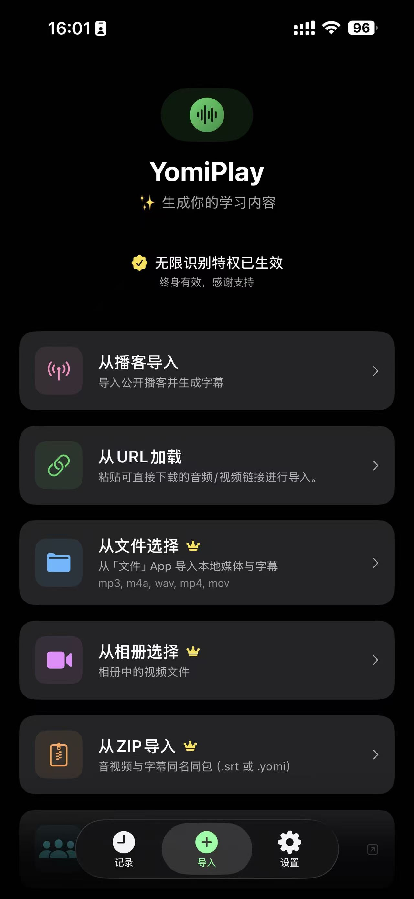
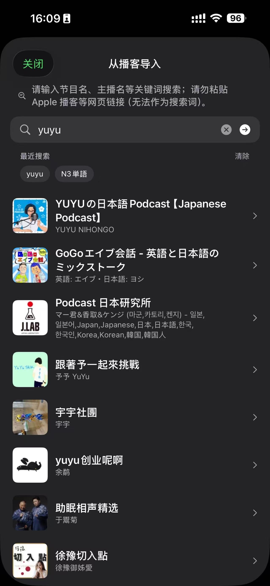
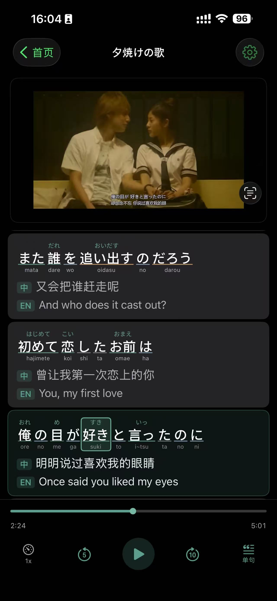
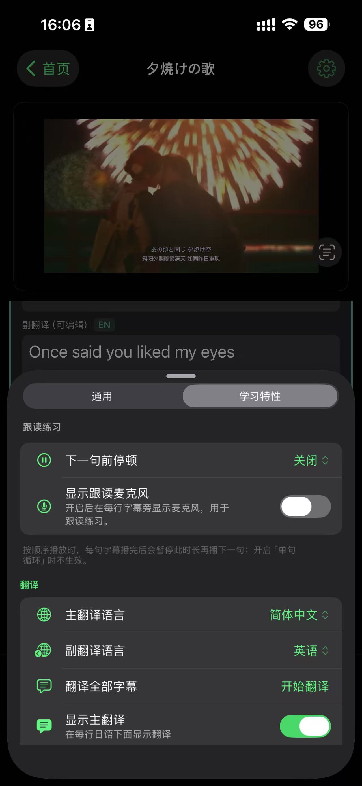
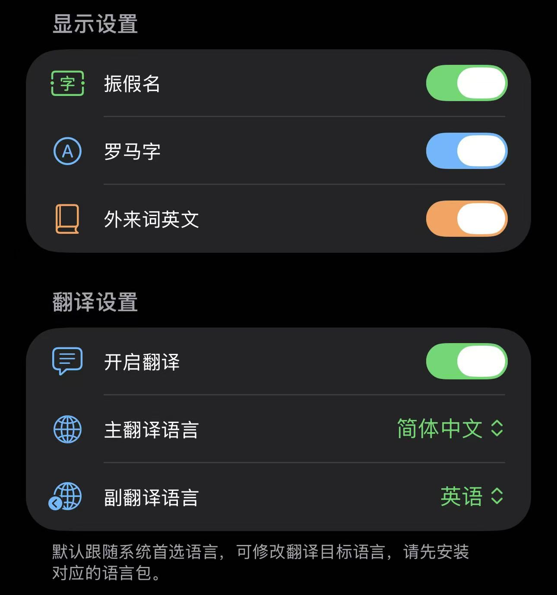
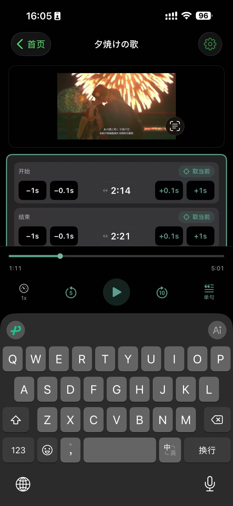
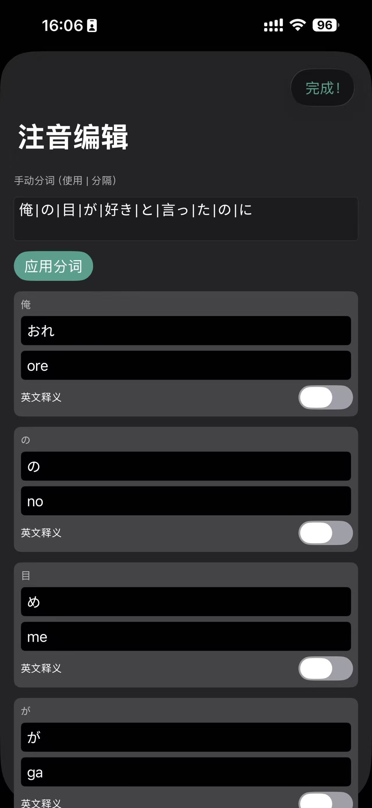
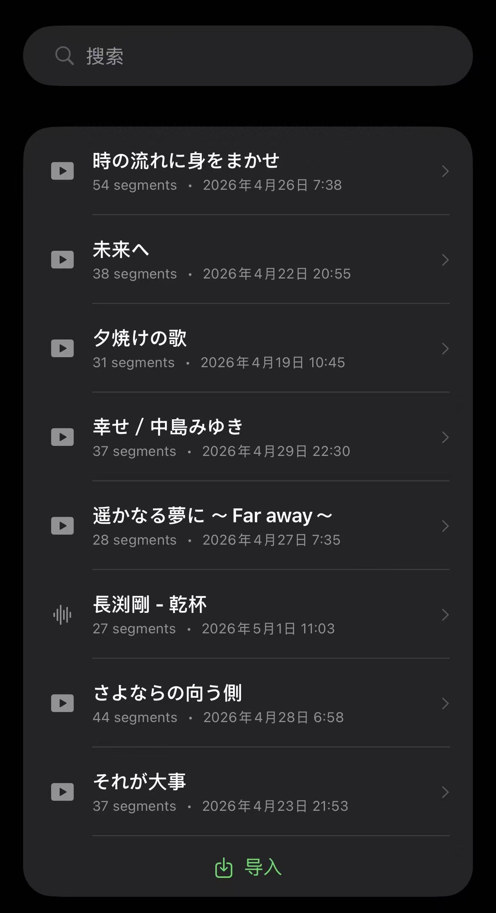
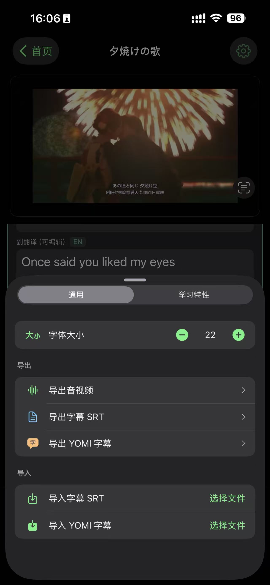

# 我做了一款App：YomiPlay，能把日语音视频变成可视听、可跟读、可编辑、可分享的学习资料

2026年4月1日

**从会议录屏到日语学习资料：YomiPlay到底能做什么？**

做 YomiPlay 的起点，说白了就是一个程序员的“直男式思路”。

在参与日本公司代码 Review 会议时，我们会录屏，方便会后回放确认问题和需求细节。

但现实是：仅靠回放音视频，操作不方便，理解成本很高。特别是日语会议，语速快、术语多、上下文密，反复听很多次仍然容易遗漏重点。

**于是我开始思考：**

能不能把会议录屏、播客、YouTube 视频这类音视频内容，直接变成“可听、可看、可编辑、可复习”的学习资料？

这就是 YomiPlay 的初衷。

YomiPlay核心能力：把音视频变成可操作的字幕学习流

YomiPlay 不是单点功能工具，而是一条完整流程：

导入音视频 → 自动转写字幕 → 翻译与读音辅助 → 精修字幕 → 字幕联动播放 → 本地保存与导出分享

于是，就试着把它做出来吧！

下面我按使用流程一次讲清楚它现在能做什么。

1）多来源导入：素材获取尽可能自由

你可以通过多种方式拿到学习素材：

上传本地音频/视频文件

从海量播客内容中获取音频

从 YouTube 等下载获取音视频内容

这意味着你不需要改变自己的内容习惯。

无论是工作会议录屏、技术访谈、日语播客，还是日语频道视频，都可以进入同一套学习流程。

| 导入方式 | 播客节目 |
| --- | --- | 
|  |  |

2）音视频转写为字幕：先把“听不清”变成“看得见”

导入后，YomiPlay 会用AI模型将音视频内容转写为字幕文本。

这一步解决的是最基础、也最关键的问题：把语音信息结构化。

当语音变成字幕后，你会明显感受到理解效率提升：

不再只能“盲听”

信息点可回看、可定位

长音频也能快速抓住重点段落

3）字幕与播放点位联动：点击一句，直达对应时间

YomiPlay 支持通过字幕反向控制播放：

点击某句字幕，立即跳转到对应音视频位置

可以围绕某个句子反复听，做精听训练

也适用于会议复盘时快速定位关键讨论段

这比传统进度条拖拽精确得多，特别适合“只想复习某一句/某一段”的场景。

4）字幕翻译：切换到用户本国语言理解内容

针对日语学习或跨语言理解场景，YomiPlay 支持字幕翻译。

你可以将字幕转换为自己更熟悉的语言进行对照理解。

核心价值不是“替代原文”，而是：

降低首次理解门槛

帮助核对语义

让你把注意力放在真正难点上

5）读音标注：延续YomiMark经验，强化日语可读性

这块是 YomiPlay 的一个特色能力。

结合我之前 YomiMark 的开发积累，YomiPlay 对日语学习做了进一步辅助，包括：

日语读音标注（帮助快速建立读法）

对片假名外来语等内容的可读性支持（标注English原文或翻译）

对于“能看懂一点，但读不顺、听不稳”的学习者，这一步会非常有帮助。

6）边听边精修字幕：学习资料不是“生成完就结束”

YomiPlay 不是只做“自动生成”，还支持你在播放过程中精修字幕：

一边听，一边校正文本

把机器结果变成更准确、更适合自己复习的版本

把一次性内容沉淀成长期可用资料

这点对会议复盘尤其实用：

你可以把关键术语、需求表达准确理解到位，精修字幕的过程就是一个很好的学习过程。

| 编辑时序 | 注音编辑 |
| --- | --- | 
|  |  |

7）本地存储与资料沉淀：形成你的私有学习资产

最终形成的字幕资料会存储在用户本地，你学习时无需使用网络。

这意味着你可以持续积累自己的日语语料库，用于：

影子跟读训练

精听复盘

术语回顾

口语表达模仿

不仅是随时随地学习效率的提升，关键是“看过多少内容”，就“沉淀了多少可重复使用的资料”。

8）导出与分享：从个人学习到协同学习

如果你愿意，也可以把整理好的学习资料导出并分享给好友或同事。

从单人使用延伸到多人共学，这会让同一份优质内容产生更高价值。

YomiPlay适合哪些人？

需要复盘日语会议录屏的工程师/职场人

想把播客、YouTube 当作真实语料学习的日语学习者

希望把“听过”变成“可复习素材”的长期学习者

需要字幕可编辑、可定位、可导出的内容使用者

## 结语：我做的不是“播放器”，而是“可复用的学习流程”

YomiPlay 的目标很明确：

让音视频内容从一次性消费，变成可训练、可沉淀、可分享的学习资产沉淀。

如果你也有“听不懂、听得多、留不住、复盘难”的问题，欢迎试试 YomiPlay。

希望它能帮你把每一次输入，真正转化成可见的能力增长。

Developed with ❤️ by Toshiki.Tech